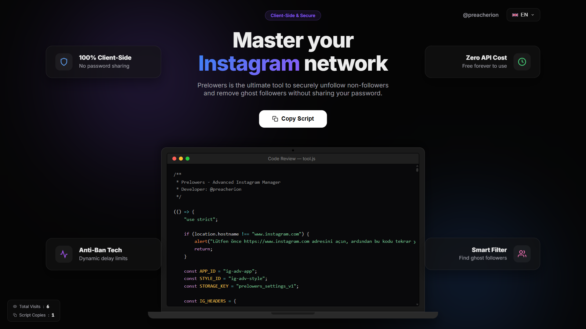

  
  <h1>Prelowers - Advanced Instagram Manager</h1>
  
<strong>Take complete control of your Instagram followers and following securely and effortlessly.</strong>

  
  
  
  
  

 

  

 

## 🚀 What is Prelowers?

**Prelowers** is a highly advanced, browser-based tool designed to help you manage your Instagram followers and following securely. 

Tired of giving your password to shady third-party apps that get your account banned? Prelowers runs **entirely in your browser's Developer Console**. It uses Instagram's own internal APIs to fetch data securely while you are already logged in.

## ✨ Mega Update Features (v5)

- 🎛️ **Interactive Script Generator:** Customize the script directly on our website! Set the Language, Action Speed, and Verified Account Protection before even copying the code.
- 🎨 **Dynamic Theme Engine & Glassmorphism:** Switch the entire website's design instantly. Choose between Cosmic (Default), Hacker Mode, Dark Elegance, or Hello Kitty (Pastel) to match your vibe. Beautiful translucent panels make the interface feel modern and premium.
- 📱 **Progressive Web App (PWA):** Install Prelowers Web directly to your mobile device or desktop screen for instant access like a native app.
- 🔔 **In-Script Live Notifications:** While the script is running in Instagram, get beautiful, non-intrusive floating toasts right inside the app panel (complete with User Avatars) to track exactly who is being removed or unfollowed!
- 📊 **Downloadable HTML Reports:** Once the script finishes running, instantly download an offline HTML report to see exactly what actions were successful or failed.
- 🌍 **Full 5-Language Support:** Both the website and the script are fully translated into English, Turkish, Spanish, German, and French, with dynamic language switching.
- 🚀 **Animated Statistics & Beautiful Layouts:** Smooth entrance animations, live counters, and step-by-step visual guides ensure a stunning user experience.

## 🛡️ Core Capabilities

- 🔒 **100% Secure & Client-Side:** Your password never leaves your device. No backend servers, no data collection.
- 🛑 **Anti-Ban Technology:** Built-in dynamic delays to simulate human behavior and bypass Instagram's rate-limits safely.
- 👻 **Smart Ghost Detection:** Accurately cross-references your followers and following to instantly find people who don't follow you back, and analyzes engagement on your last 3 posts to find true ghost followers.
- ⚡ **Zero API Cost:** Completely free to use forever. No hidden subscriptions.

---

## 🛠️ How to Use

Using Prelowers is incredibly easy. No installation required.

1. **Visit the Web App:** Go to [prelowers-web.vercel.app](https://prelowers-web.vercel.app)
2. **Configure your Script:** Use the "Advanced Settings" panel to set your language, speed, and safety toggles.
3. **Copy the Script:** Click the massive **"Copy Script"** button.
4. **Open Instagram:** Go to [Instagram.com](https://instagram.com) and ensure you are logged in.
5. **Run the Script:**
   - Press `F12` (or Right Click -> Inspect) to open Developer Tools.
   - Go to the **Console** tab.
   - Paste the code you copied and press `Enter`.
6. **Enjoy:** The beautiful Glassmorphism App Panel will pop up instantly on your screen!

---

## 👨‍💻 Developed By

This project was built with ❤️ by [@preacherion](https://instagram.com/preacherion). 

If you found this tool useful, feel free to contribute, open issues, or share it with your friends. Stay safe on Instagram!
